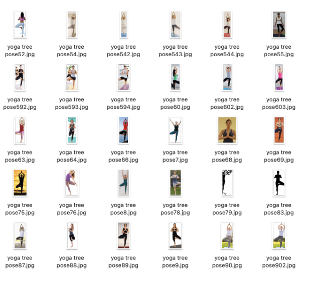
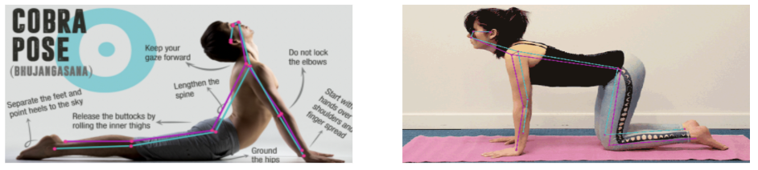

# 🧘🏻‍♀️ Yoga Pose Detection 🧘🏻‍♀️
###### Yoga Pose Detection
 

Pose Detction을 통해 요가 자세의 정확도를 평가하여 올바른 자세인지 판단

 

## __📌 프로젝트 진행 순서 📌__
### 1. Image Crawling
* 요가 사진 Web Crawling
    * Selenium
### 2. Image 전처리
* Person Detection 및 Crop
    * YOLOv5
### 3. Pose Detection
* Image, gif Pose Detection
    * Movenet, MediaPipe
### 4. Video Pose Detection
* 영상 내 움직임 감지
    * MediaPipe, OpenCV
* 동작 별 구분

 

## __📌 1. 데이터 수집 📌__
__1) Image Crawling__
<!-- <a href="https://drive.google.com/drive/folders/1Ciq-_KrDGRHzgdnoVzq0FdU93TGDZN-B"> 구글 드라이브 </a> -->
Selenium을 이용한 이미지 데이터 수집

 

## __📌 2. Image 전처리 📌__
__1) Person Detection__
YOLOv5를 이용한 Person Detection 및 이미지 크롭 진행

 

## __📌 3. Pose Detection 📌__
Movenet, MediaPipe을 이용한 Pose Detection 실험

 

## __📌 4. Video Pose Detection 📌__
MediaPipe, OpenCV를 이용하여 비디오 내 움직임 Detection
<!-- 평상시 - 흰색 | 정상 - 초록색 | 부족 - 노란색 | 측정불가 - 빨간색 -->
일반 - ⚪️ | 정상 - 🟢 | 부족 - 🟡 | 측정불가 - 🔴
 
   
 
 
