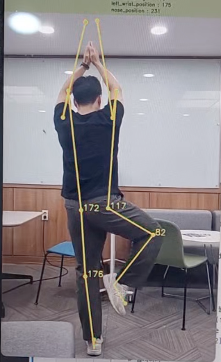

# 🧘🏻‍♀️ 요가 자세 🧘🏻‍♀️
###### yoga pose
 

Pose Detction을 통해 요가 자세의 정확도를 평가하여 올바른 자세인지 판단

 

## __📌 프로젝트 진행 순서 📌__
### 1. 데이터 수집
* 요가 사진 Web Crawling
### 2. 데이터 전처리
* 수집한 이미지에서 Person Detection
    * YOLOv5
### 3. 자세 평가
* 요가 자세 Pose Estimation
    * MediaPipe
### 4. 결과 판단
* input Pose Detection
 

## __📌 1. 데이터 수집 📌__
__1) 이미지 Web Crawling__
<!-- <a href="https://drive.google.com/drive/folders/1Ciq-_KrDGRHzgdnoVzq0FdU93TGDZN-B"> 구글 드라이브 </a> -->

 

## __📌 2. 데이터 전처리 📌__
__1) Person Detection__
 

## __📌 3. 자세 평가 📌__
<!-- 평상시 - 흰색 | 정상 - 초록색 | 부족 - 노란색 | 측정불가 - 빨간색 -->
일반 - ⚪️ | 정상 - 🟢 | 부족 - 🟡 | 측정불가 - 🔴
 
   
 

## __📌 4. 테스트 📌__

 

## __📌 자체 평가 및 개선점 📌__
 
